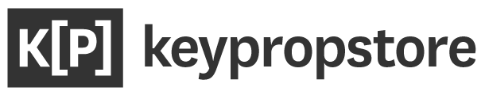

------
  

Simulates a column store, where a key could be tagged with multiple key value properties.

- Multiple services could report keys with associated properties, it will appended the local store.
- Query for property/properties would return the keys associated with those property/properties from local store (default)
- Keypropstore is hosted in a region consists of local and optional aggregate stores, with configurable backends (default InMemoryStore).
- Aggregate stores are configured to sync remote local stores into a separate aggregate store instance.
- Queries could be made to aggregate store, could also potentially host multiple aggregate store instances.

## Architecture

## Store Core

Keypropstore consists of multiple [store core](docs/CORE.md), local and/or aggregate.
